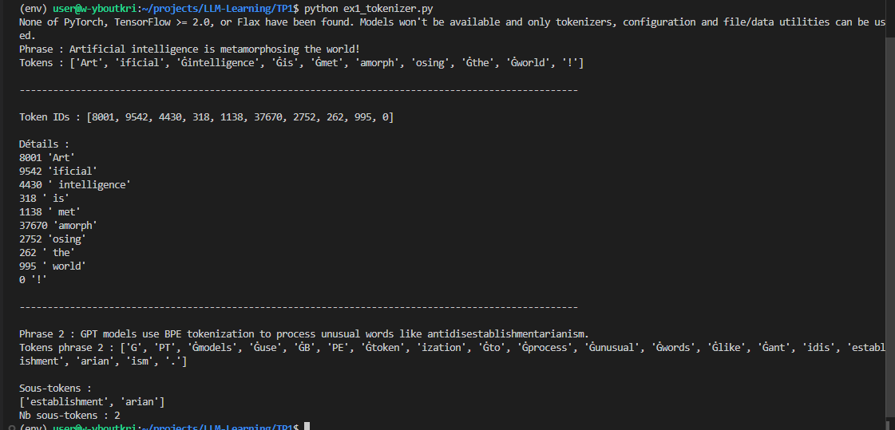
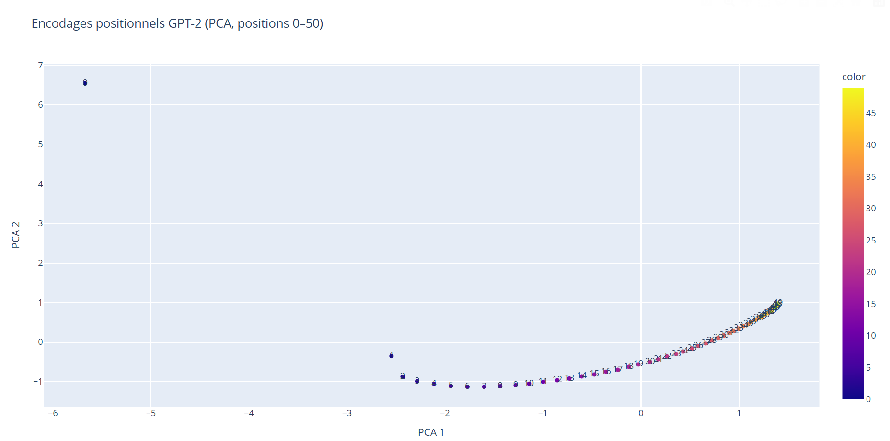
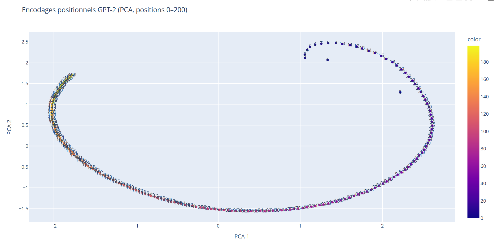
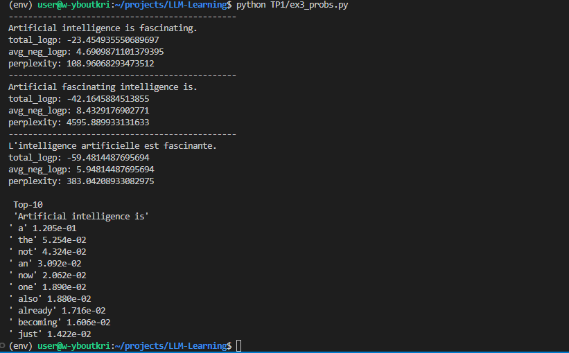
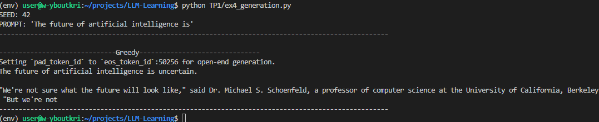
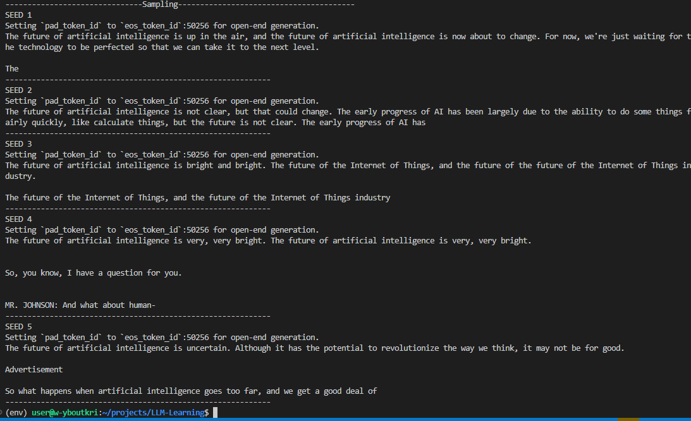
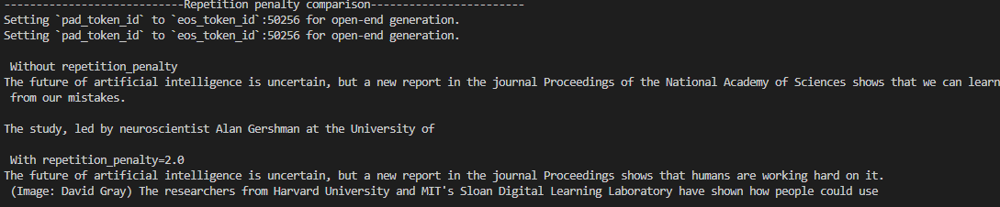
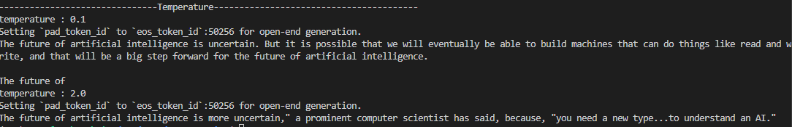
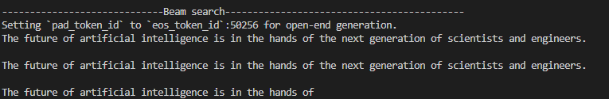
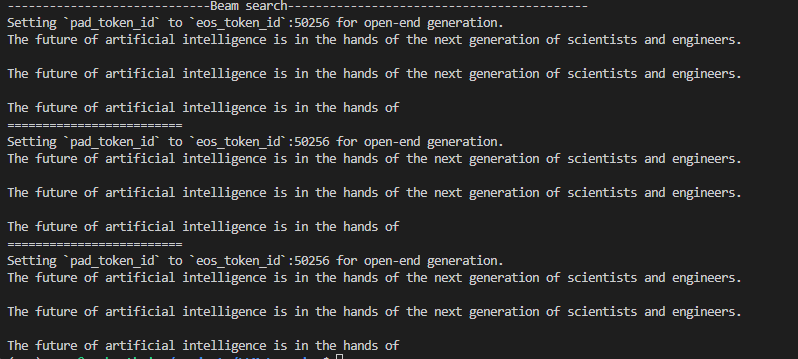

# Tokenisation / Positional Encoding / GPT-2

- **Nom / Prénom** : Boutkrida Younes
- **OS** : Ubnutu
- **Python** : Python 3.12.3

##  Tokenisation BPE avec GPT-2

Tokens : ['Art', 'ificial', 'Ġintelligence', 'Ġis', 'Ġmet', 'amorph', 'osing', 'Ġthe', 'Ġworld', '!']

Certains tokens débutent par "Ġ", ce qui indique qu’un espace précède dans le texte. Cela aide GPT-2 à différencier les débuts de mots des sous-mots internes grâce au tokenizer BPE.

Token IDs + tableau Markdown:

| Token (décodé) | Token ID | 
|----------------|----------|
| Art            | 8001     | 
| ificial        | 9542     |
|  intelligence  | 4430     | 
|  is            | 318      | 
|  met           | 1138     |
| amorph         | 37670    |
| osing          | 2752     | 
|  the           | 262      | 
|  world         | 995      | 
| !              | 0        |

Les tokens sont les unités textuelles manipulées, et les token IDs leurs représentations numériques. Cela permet aux modèles de langage de travailler uniquement avec des nombres.

Observations GPT-2 BPE :
1. Mots rares ou longs → plusieurs sous-tokens.
2. Espaces intégrés via "Ġ".
3. Ponctuation = tokens isolés.

Byte Pair Encoding :
Le vocabulaire est basé sur des fragments fréquents réutilisables, capables de construire tout mot inconnu avec des sous-tokens.

Exemple : antidisestablishmentarianism
Tokens : ['Ġant', 'idis', 'establishment', 'arian', 'ism', '.']
Le mot est découpé en sous-tokens réutilisables pour représenter efficacement les mots rares.

## Encodages positionnels (GPT-2)

Shape position embeddings: torch.Size([50257, 768])
n_embd: 768
n_positions: 1024

La matrice des encodages positionnels est de dimension (n_positions, n_embd), où :
- **n_positions** : représente le nombre maximal de positions (ou tokens) que GPT-2 peut traiter dans une séquence en une fois.
- **n_embd** : correspond à la taille des vecteurs d'embedding utilisés pour chaque position.

Chaque ligne de la matrice est un vecteur unique, appris par GPT-2, qui encode la position associée. Cela permet au modèle d’intégrer des informations sur la place relative des tokens dans le contexte global.

**Particularités pour les modèles de langage causal** :
- La valeur de **n_positions** détermine la limite maximale du contexte que le modèle peut considérer. Si une séquence dépasse cette longueur, les tokens les plus anciens sont ignorés.
- Dans ce cadre, la prédiction du token à la position **t** dépend uniquement des tokens situés aux positions précédentes (**t-1, t-2, ...**), mais jusqu’à **n_positions** au maximum. Les informations antérieures à cette limite ne sont pas accessibles au modèle.

PCA : positions 0–50

PCA : positions 0–200

Lorsqu’on visualise les positions proches dans l’espace PCA, elles ont tendance à s’organiser de manière continue, affichant une trajectoire fluide plutôt qu’une configuration totalement aléatoire. Certains regroupements plus denses apparaissent, mettant en évidence des similarités entre les embeddings de positions spécifiques. Cette continuité et ces regroupements reflètent une organisation non linéaire, où les représentations apprises par GPT-2 structurent les positions selon des relations complexes plutôt que simples.

**Pourquoi PCA ?**
Les embeddings positionnels sont de dimension n_embd, ce qui rend leur visualisation directe impossible. La PCA (Analyse en Composantes Principales) permet de réduire cette dimension à 2 tout en préservant une partie significative de la variance des données. Cela fournit une représentation interprétable qui révèle des schémas utiles sans sacrifier trop d’information.

**Comparaison 0–50 vs 0–200 (obligatoire)**
En augmentant la plage de positions visualisées de 0–50 à 0–200, la densité des points augmente, rendant la trajectoire plus complexe. Parmi ces points supplémentaires émergent potentiellement des motifs globaux qui étaient invisibles à échelle réduite. Toutefois, la multiplication des points peut aussi brouiller des structures locales plus claires observées sur 50 points.

**Hypothèse :**
GPT-2 semble apprendre une organisation des positions qui opère efficacement à plusieurs échelles : aussi bien localement (proximité immédiate) que globalement (longueurs de séquences étendues). Ces embeddings encapsulent des relations entre positions proches, tout en différenciant les positions distantes. En 2D via la PCA, cet agencement apparaît simplifié, alors qu’en dimension complète, les vecteurs peuvent représenter des structures bien plus riches pour maintenir une attention efficace entre tokens éloignés ou proches.

## Probabilités, log-probabilités et perplexité (GPT-2)

1 'ificial' 1.920e-05
2 ' intelligence' 1.505e-01
3 ' is' 1.955e-01
4 ' fascinating' 6.504e-04
5 '.' 1.773e-01

GPT-2 est un modèle de langage causal : à chaque position i, il génère une distribution P(x_{i+1} | x_{\le i}) pour prédire le token suivant. Autrement dit, la probabilité d’un token à l’index t est extraite des logits de la position t-1.

total_logp: -23.454935550689697
avg_neg_logp: 4.6909871101379395
perplexity: 108.96068293473512

La perplexité évalue l’incertitude du modèle sur une séquence donnée. Elle est définie comme exp(moyenne des -log-probabilités), représentant le nombre moyen de choix possibles par token. Une perplexité faible indique que le modèle attribue des probabilités élevées aux tokens, signifiant une phrase cohérente et attendue. À l’inverse, une perplexité élevée reflète une séquence improbable, souvent due à un ordre atypique, des tokens rares, une construction inhabituelle ou une langue peu représentée dans les données d'entraînement.

-----------------------------------------------
Artificial intelligence is fascinating.
total_logp: -23.454935550689697
avg_neg_logp: 4.6909871101379395
perplexity: 108.96068293473512
-----------------------------------------------
Artificial fascinating intelligence is.
total_logp: -42.1645884513855
avg_neg_logp: 8.4329176902771
perplexity: 4595.889933131633

La phrase S2 présente une perplexité plus élevée en raison de son ordre de mots inhabituel. GPT-2, entraîné sur des corpus contenant des régularités syntaxiques fréquentes, reconnaît "Artificial intelligence is ..." comme une construction courante. En revanche, dans S2, les transitions entre tokens sont moins prévisibles, ce qui entraîne une diminution des probabilités conditionnelles et une augmentation de la somme des -log-probabilités, conduisant ainsi à une perplexité accrue.

-----------------------------------------------
L'intelligence artificielle est fascinante.
total_logp: -59.4814487695694
avg_neg_logp: 5.94814487695694
perplexity: 383.04208933082975

GPT-2 est principalement entraîné sur des corpus en anglais, tandis que le français y est sous-représenté. Cela entraîne une probabilité réduite pour certaines séquences de tokens en français. Par ailleurs, la tokenisation BPE peut fragmenter certains mots français en sous-tokens rares, ce qui contribue également à une perplexité accrue.

 Top-10 
 'Artificial intelligence is'
' a' 1.205e-01
' the' 5.254e-02
' not' 4.324e-02
' an' 3.092e-02
' now' 2.062e-02
' one' 1.890e-02
' also' 1.880e-02
' already' 1.716e-02
' becoming' 1.606e-02
' just' 1.422e-02

Les propositions générées sont généralement cohérentes.
On remarque fréquemment des tokens débutant par un espace, reflétant l'intégration explicite des espaces dans la tokenisation de GPT-2.
De plus, la ponctuation peut être présente lorsque le modèle estime qu'elle améliore la structure ou délimite les phrases de manière appropriée.

## Génération (greedy / sampling / beam search)

- Seed utilisé : 42

On fixe un seed pour rendre la génération reproductible

Le résultat reste constant même après 3 relances :
Le greedy est une méthode déterministe, sélectionnant systématiquement le token le plus probable à chaque étape.
Ainsi, avec un modèle identique, la séquence générée reste inchangée.
-> Le seed n’a aucun effet sur le greedy, car aucun échantillonnage aléatoire n'est impliqué.

-------------------------------------------------------------------------------------------------------------------

Capture : 

Comparaison avec greedy : 
Le sampling génère des textes diversifiés en fonction du seed, offrant une variété plus large en termes de thèmes, formulations et structures.
Cependant, il peut entraîner des répétitions ("very, very bright") ou des transitions abruptes, comme dans certains dialogues ("MR. JOHNSON").
Le greedy, par contraste, est plus déterministe et produit des textes généralement linéaires et stables, bien que souvent plus génériques et moins créatifs.
Le sampling explore ainsi de multiples possibilités au lieu de sélectionner uniquement le token le plus probable.

Impact des paramètres (aspects qualitatifs) :
- **Température (0.7)** : Réduit l’échelle de probabilité, rendant les générations plus structurées et moins imprévisibles qu’avec des températures plus élevées (1.0+).
- **top-k=50** : Restreint la sélection aux 50 tokens les plus probables, simplifiant les choix et favorisant la cohérence.
- **top-p=0.95** : Applique le nucleus sampling, limitant la sélection à un ensemble dynamique de tokens cumulant 95% de la probabilité totale, combinant diversité et cohérence de manière équilibrée.

Répétition :

Avec l'application d'une pénalité, la génération devient plus concise tout en limitant les répétitions excessives, comme "a long way off".
Cela permet souvent de réduire les boucles ou comportements répétitifs, mais peut parfois introduire un effet indésirable en évitant certains termes pertinents, rendant le texte plus abrupt ou tronqué.

Température  :

Une faible température (~0) aboutit à une génération quasi déterministe, favorisant les tokens les plus probables.
Le résultat est un texte très cohérent et structuré, mais avec un manque évident de diversité.
À l'inverse, une température élevée (~1.5+) aplatit la distribution des probabilités, permettant la sélection de tokens moins attendus.
Cela enrichit la créativité et la variété du texte, mais augmente également l’instabilité.
Ce comportement souligne un compromis essentiel entre cohérence et diversité dans la génération de texte.

Beam search:

Le beam search vise à trouver une séquence optimisée en évaluant simultanément plusieurs candidats.
Le résultat produit une phrase généralement bien structurée et réaliste, bien que des répétitions significatives puissent émerger.
Par rapport au sampling : offre une diversité moindre, mais une meilleure cohérence et stabilité.
Par rapport au greedy : explore davantage pour identifier des séquences globalement probables, au risque d'accentuer les répétitions dans les segments de haute probabilité locale.

Nombre de beams différents :

Le beam search maintient num_beams séquences candidates à chaque étape et les développe individuellement.
Augmenter ce paramètre élargit l'exploration, augmentant ainsi le temps de calcul nécessaire pour évaluer davantage de chemins potentiels.
Ce processus engage un compromis : une exploration plus approfondie peut améliorer la qualité globale des séquences générées, mais se traduit par un coût computationnel accru.
