# TP 4

## 1

le résultat de curl http://127.0.0.1:PORT

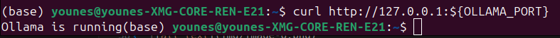

le résultat de ollama run MODEL_NAME ...

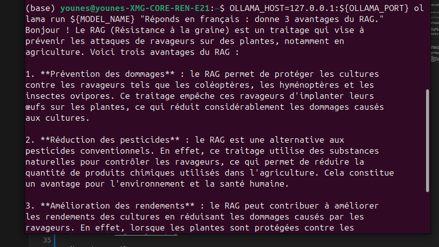

le port choisi (et si cluster : la commande SSH tunnel)

## 2

Execution script :

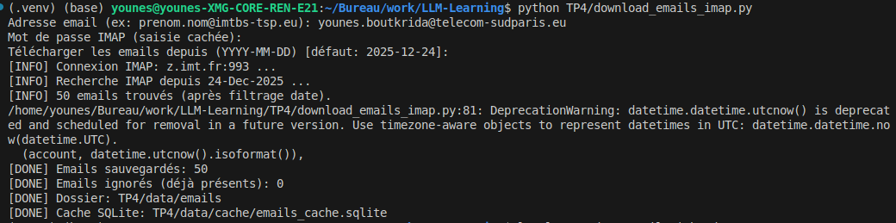

Nombre de fichiers téléchargés :

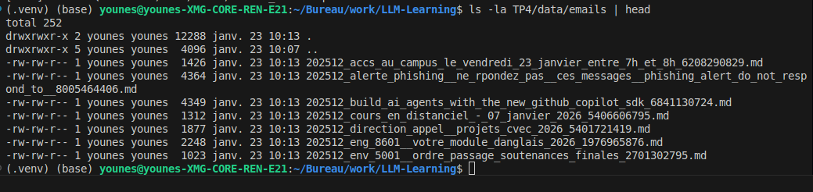

Début d'un mail :

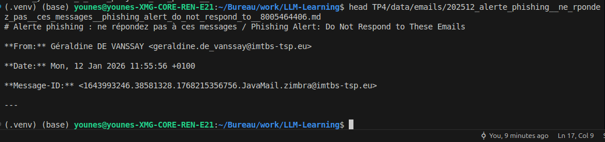

## 3

la sortie console de python TP4/build_index.py (nb docs + nb chunks)

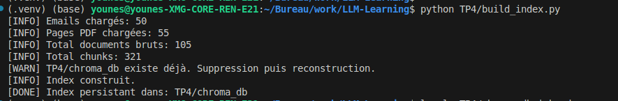

un ls -la TP4/chroma_db prouvant que l’index est créé

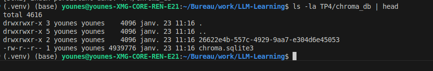

## 4

La valeur choisie de topk est de 5.

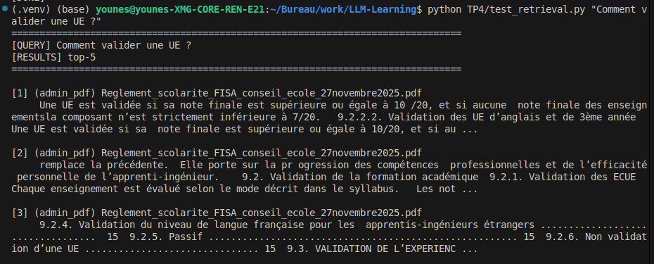

Dès le premier mail, on trouve un message en lien avec les sujets supplémentaires de PFE proposé par Luca Benedetto. De même, pour la deuxième question, les réponses apparaissent rapidement parmi les premières lignes des résultats.

## 5

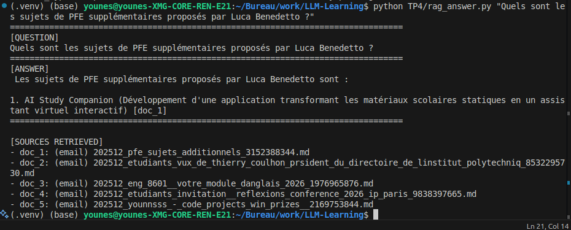

Le script se déroule parfaitement

Cette réponse aussi est en français et complète avec les sources correctement cités.

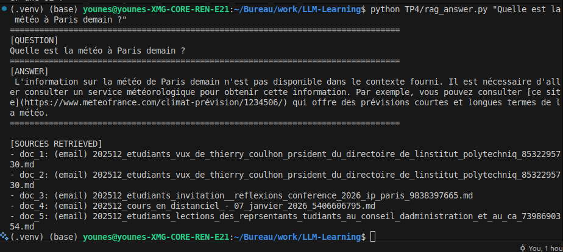

Dans ce cas où l'information n'est pas donné, le modèle répond bien que l'information n'est pas disponible.

## 6

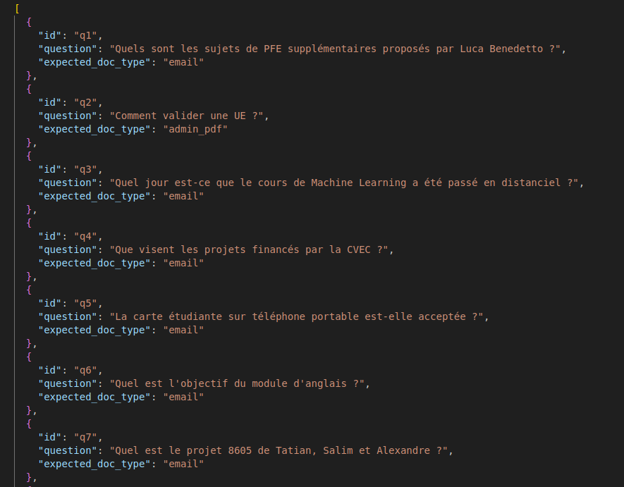

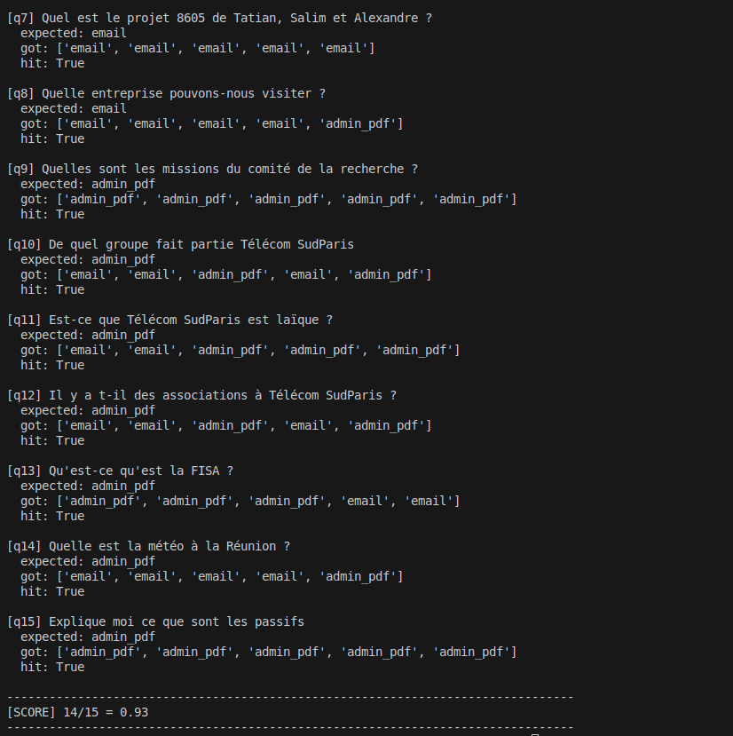

Le modèle trouve des réponses à toutes les questions hormis la question sur des informations qu'il ne possède pas : la météo à la Réunion, ce qui semble logique.

### Bilan et perspectives

**Points positifs :**  
La recherche d’informations a été très efficace lorsque les mots-clés étaient présents dans les documents, comme en témoigne le score d’eval_recall. Lorsque la réponse se trouvait dans un paragraphe court, le LLM fournissait des réponses précises.

**Limites rencontrées :**  
Les informations doivent impérativement être présentes dans les fichiers partagés, et le LLM a parfois du mal à maintenir la cohérence des explications sur des réponses longues. Même si l’information est retrouvée, la qualité des explications peut en pâtir.

**Axes d’amélioration prioritaires :**  
Pour rendre ce RAG plus performant, il serait pertinent d’augmenter la taille des chunks afin d’améliorer la compréhension contextuelle des documents. Il serait également intéressant d’élargir la base documentaire, par exemple en intégrant l’ensemble des fichiers disponibles sur Google Drive.
